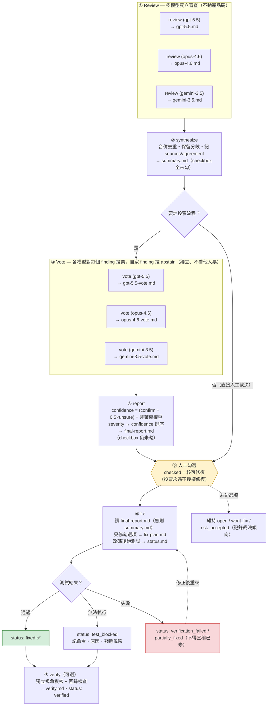

# Code Review

Two complementary Agent Skills for the work that happens around a change:
finding what is wrong with it, and demonstrating that the result holds up.

They are independent. Neither reads nor writes the other's artifacts, and each
runs on its own. When both apply, run them in sequence — review and fix first,
then the gate — never as two parallel workflows.

## Skills

| Skill | Question it answers | Artifacts |
|---|---|---|
| `review-forge` | What is wrong with this change, and which of it do we fix? | `.review/<feature>/` |
| `verification-gate` | What can be demonstrated about this change without reading the implementation? | `.gate/<scope>/` + a persisted entry point in `tools/` |

## Installation

This plugin ships as `code-review` in the `coding-agent-toolkit` marketplace.
In Claude Code:

```text
/plugin marketplace add gn00678465/coding-agent-toolkit
/plugin install code-review@coding-agent-toolkit
```

For other clients that read cross-client Agent Skills, copy the skill folders
directly:

```sh
cp -R plugins/code-review/skills/review-forge ~/.codex/skills/review-forge
cp -R plugins/code-review/skills/verification-gate ~/.codex/skills/verification-gate
```

Then invoke from a compatible agent with `/review-forge` or
`/verification-gate`. If a client does not support explicit `/skill` syntax,
ask it to use the skill by name or select it from the client's skills UI.

---

## review-forge

`review-forge` orchestrates multi-pass LLM review, finding synthesis,
human-approved fix selection, implementation, regression testing, independent
verification, and status tracking.

### What It Does

- Reviews local changes, branches, PRs, or commit ranges.
- Synthesizes multiple review perspectives into one fix checklist.
- Cross-votes findings between models to separate real issues from false positives.
- Ranks the final report by severity and weighted vote confidence.
- Uses checkboxes as the human approval boundary for fixes.
- Fixes only approved items.
- Requires tests after fixes unless testing is blocked and documented.
- Verifies fixes independently when possible.
- Keeps process artifacts isolated under `.review/`.

### Commands

- `review`: create one model-specific review file.
- `synthesize`: merge review files in one feature folder into `summary.md`.
- `vote`: one model votes confirm/dispute/unsure on `summary.md` findings it did not originate, into `<model>-vote.md`.
- `report`: aggregate votes into a confidence-ranked `final-report.md`.
- `fix`: fix checked items, run tests, and update status.
- `verify`: verify fixed items, inspect or rerun tests, and update status.

### Workflow



### Default Review Scope

When no target or base is specified:

1. If there are uncommitted or staged changes, Review Forge reviews the working
   tree diff.
2. If the working tree is clean, it reviews `main...HEAD`.
3. If `main` does not exist, it tries `master...HEAD`.
4. If no reasonable base can be inferred, it asks for one.

Explicit PRs, branches, commit ranges, or base refs always override these
defaults.

### Artifacts

Review Forge groups workflow files by feature under `.review/`:

```text
.review/<feature>/
  opus-4.6.md
  gpt-5.5.md
  gemini-3.5.md
  summary.md
  opus-4.6-vote.md
  gpt-5.5-vote.md
  gemini-3.5-vote.md
  final-report.md
  fix-plan.md
  verify.md
  status.md
```

Each model review should produce one file named after the model or agent. If
the same model runs multiple perspectives, use a suffix such as
`gpt-5.5-security.md`.

Command outputs are intentionally simple:

- `review` creates one model review file only, for example `gpt-5.5.md`.
- `synthesize` creates `summary.md` only.
- `vote` creates one vote file only, for example `gpt-5.5-vote.md`.
- `report` creates `final-report.md` only.
- `fix` reads `final-report.md` when present (otherwise `summary.md`), then
  creates or updates `fix-plan.md` and `status.md`.
- `verify` creates or updates `verify.md` and `status.md`.

Add `.review/` to the target repository's `.gitignore` unless you
intentionally want to commit review process files.

### Language Policy

The skill instructions, template field names, and machine-readable status enums
are in English. Generated reports can use `report_language: auto` to follow the
user's prompt language, or explicit values such as `en`, `zh-TW`, or `ja`.

Status values remain stable English enums, while display labels may be localized.

### Example Prompts

```text
Use /review-forge review feature: checkout-refactor model: codex.
```

```text
Use /review-forge review feature: checkout-refactor model: opencode perspective: security.
```

```text
Use /review-forge synthesize feature: checkout-refactor.
```

```text
Use /review-forge vote feature: checkout-refactor model: gpt-5.5.
```

```text
Use /review-forge report feature: checkout-refactor model_weights: gpt-5.5: 1.5.
```

```text
Use /review-forge fix feature: checkout-refactor.
```

```text
Use /review-forge verify feature: checkout-refactor.
```

---

## verification-gate

`verification-gate` runs after the code is written. It answers one question:
what can be demonstrated about this change without anyone reading the
implementation?

It is **not** a review skill. It does not look for defects, rank findings, or
propose fixes. It runs checks and reports results.

### What It Does

- Reads git for facts: change set, changed units, commit-message intent,
  baseline failures at the base ref, source state.
- Asks the human once for what the change was supposed to do, and records the
  answer verbatim. Never treats conversation history or a compaction summary as
  the intent record.
- Runs the layer stack: full suite (zero NEW failures), types, lint,
  changed-line coverage with a failing threshold, mutation, property-based
  tests, complexity budget, real execution, supply chain and secrets, suite
  health.
- Reconstructs RED: replays the newly added tests against the base ref and
  requires them to fail there.
- Requires home-grown checks to fail closed and to have been seen failing
  against a known-bad input before their pass is trusted.
- Ends with an evidence report whose every number comes from one fresh run of a
  persisted entry point.

### Commands

- `scaffold`: create or repair the gate entry point and helper scripts in the
  target repository. Writes to product paths — confirm first.
- `gate`: run the layers and report results. Iterative; no report written.
- `evidence`: run the entry point once and write the evidence report from that
  single run.

### Intent Status

The gate may run in a later session, a different agent, or past a context
compaction, so it takes nothing on trust from the conversation. The report
header always records which of three states applies, and the skill never
promotes one silently:

| Status | Meaning |
|---|---|
| `confirmed` | the human confirmed the intent this run, or pointed at a spec, issue, or PR |
| `unconfirmed` | non-interactive run; intent derived from git only |
| `absent` | git yields no usable intent and no one is available to ask |

`unconfirmed` and `absent` do not block the gate. Every executable layer still
runs — those layers ask whether the code is self-consistent, which needs no
intent. What degrades is the mapping, and the report says so.

### Artifacts

```text
.gate/<scope>/
  evidence.md      # the report
  baseline.md      # pre-existing failures at base, recorded verbatim
  red.md           # RED reconstruction results
```

Add `.gate/` to the target repository's `.gitignore` unless you want the report
committed. The entry point and its helpers are **not** artifacts — they belong
in `tools/` and should be committed, because a report citing a script that
exists only in a scratch directory is not reproducible.

### Example Prompts

```text
Use /verification-gate scaffold — this repo has no gate entry point yet.
```

```text
Use /verification-gate gate on the working tree, tier 2.
```

```text
Use /verification-gate evidence for main...HEAD and write the report.
```

### Attribution

Adapted from the [`old-coder`](https://github.com/AmazingAng/old-coder) skill
(MIT, Copyright (c) 2026 amazingang). See
[`skills/verification-gate/NOTICE.md`](./skills/verification-gate/NOTICE.md)
for what was taken, what was left behind, and what was added.
